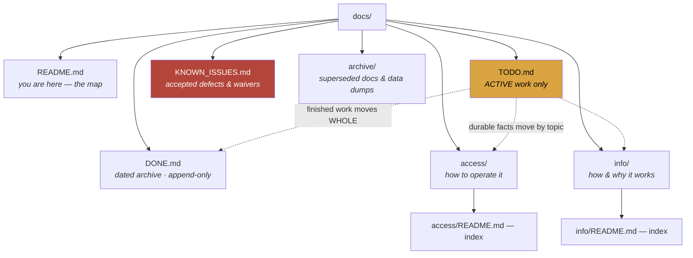

# library_catalog — docs map

> **Audience:** Claude/Kiro sessions first, the owner second.
> **Status:** ✅ **TRACKED — the whole of `docs/` is in git.**
> Last verified: **2026-09-05** — the docs audit re-walked the tree and
> **re-measured exactly two things: whether every file is tracked, and whether
> both index READMEs list every file beside them.** Everything else here
> (including the 2026-09-02 `HANDOFF.md` retirement, whose husk is
> [`archive/HANDOFF.md`](archive/HANDOFF.md)) was READ, not re-measured.
>
> 🔴 **Corrected 2026-09-05: this header said "MIXED — parts of `docs/` are
> tracked, parts are not", and the footer said the tree "is not in git … so it
> exists on the owner's machine and nowhere else". Both are FALSE.** Measured:
> `git ls-files docs` returns **56 files**, `git check-ignore` matches **none**
> of `TODO.md` / `DONE.md` / `README.md` / `access/README.md` /
> `info/README.md`, and `git status --porcelain` was **clean** — so there are
> no untracked docs either. This is not a harmless wording slip: a session that
> believes these files exist nowhere but this machine will not commit them, and
> will treat the R2 backup as the only copy.
>
> 📐 **The rules for this tree — filing, formatting, when to move things — live
> in `catalog-platform/docs/DOCS_STANDARD.md`, and ONLY there.** All four repos
> follow the same shape. Read it once; it is not restated here.
> ⚠️ ~~It lives in that repo because `catalog-platform/docs/` is the only one of
> the four trees kept in git, so it survives a clone when this one does not.~~
> **Corrected 2026-09-05: that reason is false — this tree is in git too.** It
> lives there because the standard is ESTATE-WIDE and one shared rule beats four
> drifting copies, which is the better reason anyway.

**What this project is:** the physical and print book catalogue at `library.heygabi.ai`, its second instance (`padhard`), the ISBN/barcode ladder, covers and series, the GABI site panel, and the ebook viewer work.

---

## The tree

---

## Start here

| If you want to know… | Read |
|---|---|
| **What is active right now** | [`TODO.md`](TODO.md) — its 🧰 Tech debt section is the "later" pile |
| **Is this a bug or deliberate?** | [`KNOWN_ISSUES.md`](KNOWN_ISSUES.md) |
| **Current state / how to pick up** | [`TODO.md`](TODO.md) — ⚠️ `HANDOFF.md` was **retired 2026-09-02**; husk in [`archive/`](archive/HANDOFF.md) |
| **How do I deploy / roll back** | [`access/deploy.md`](access/deploy.md) · [`access/rollback-points.md`](access/rollback-points.md) |
| **🔴 Rebuild from nothing** | [`access/RECOVERY.md`](access/RECOVERY.md) |
| **The data model, routing, covers, series** | [`info/README.md`](info/README.md) |
| **A trap I keep hitting** | [`info/gotchas.md`](info/gotchas.md) — titled by symptom |
| **Why a call was made that way** | [`info/decisions.md`](info/decisions.md) |
| **Was this already solved** | [`DONE.md`](DONE.md) |

## Where the rest of the estate is

| Repo | Covers |
|---|---|
| `catalog-platform/docs/` | 📐 **The docs standard**, estate SSO, GABI, `/status`, backups. ~~and the only tree in git~~ — ⚠️ **corrected 2026-09-05: THIS tree is in git too** (56 tracked files), so that is no longer a reason to prefer it |
| `bookbuddy/audiobook_catalog/docs/` | The audiobook pipeline, the shelf server, ebooks |
| `boardbuddy/Board_Game_Catalog/docs/` | The board-game catalogue |

~~⚠️ **This tree is not in git** (wholly or partly), so it exists on the owner's
machine and nowhere else.~~ ✅ **Corrected 2026-09-05: it IS in git — 56 tracked
files, nothing ignored, working tree clean.** See the header.
`github.com/skymitch9/library_catalog` is the second copy. All four trees are
ALSO backed up to R2 by `catalog-platform/scripts/backup-docs.mjs`; the restore
was drilled 2026-08-21. Runbook: `catalog-platform/docs/access/backup-restore.md`
§6b. ⚠️ **The repo is PUBLIC**, which is why the names-only rule on secrets is
not optional here.
